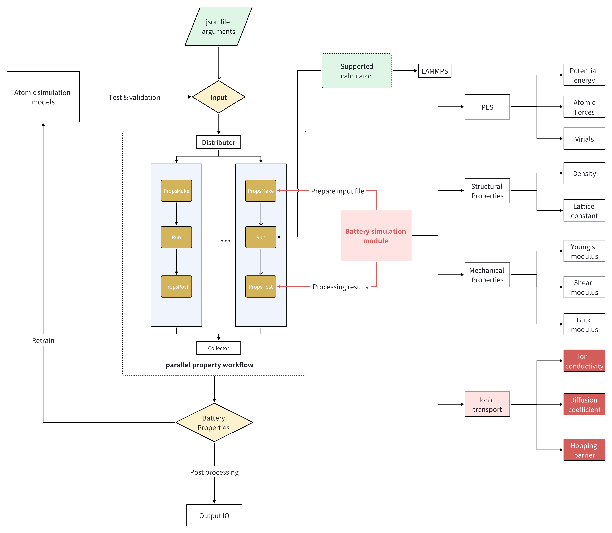
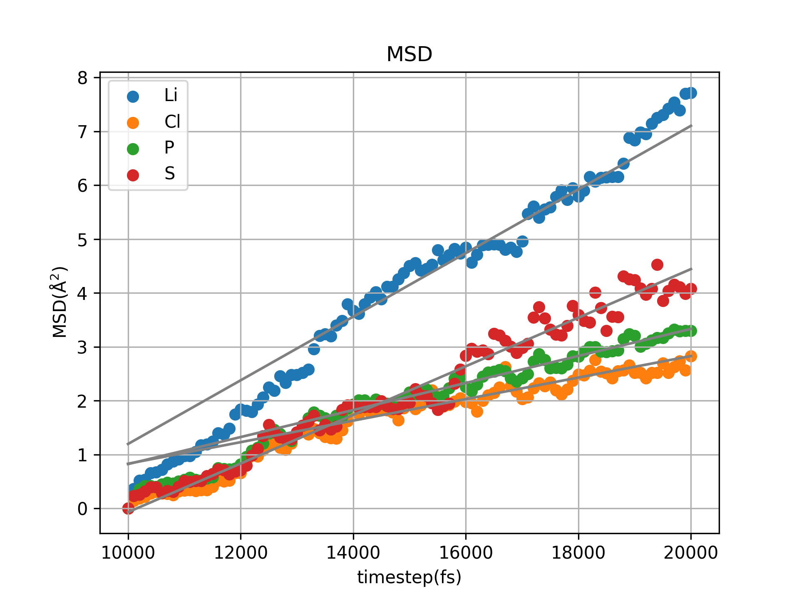

# VoltCraft
[VoltCraft](https://github.com/ruoyuwang1995ucas/LAM-SSB) aims for easy automation of battery simulation, which utilized advanced machine-learning techniques such as DeePMD and DPA. VoltCraft is currently an extension of the general [APEX](https://github.com/deepmodeling/APEX) workflow, though a standalone version dedicated to battery simulation is incoming.

## 1. Overview
VoltCraft adopts the versatile workflow design of the APEX package for alloy property simulation. By extension of the functionality modules which incorporate our know-how in AI-driven battery simulation, easy automation of complex simulation workflow, especially those for **solid state** electrolyte, such as elastic modulus, diffusion coefficient, can be realized. 

Below is a schematic showing the basic structure of VoltCraft package.
 <div>
    
    <p style='font-size:1.0rem; font-weight:none'>Figure 1. Workflow design of VoltCraft at current stage.</p>
</div>

Here, at current stage, VoltCraft mainly implements functionality modules aiming for dynamic atomic simulation of solid electrolyte at finite temperature. Critical performance parameters, e.g., [mean square displacement](https://en.wikipedia.org/wiki/Mean_squared_displacement) (MSD), diffusion coefficient and ionic conductivity, can be extracted. More properties, such as ionic hopping barrier, are forthcoming.

## 2. Installation
VoltCraft can be built and installed form the source. Clone the package firstly by
```shell
git clone https://github.com/ruoyuwang1995ucas/LAM-SSB.git
```

then install by
```shell
cd LAM-SSB
pip install .
```

## 3. Quick Start
VoltCraft can be activated either from CLI or through python API. For new users, we recommend the CLI method. We are going to demonstrate how to calculate the diffusion coefficient of Lithium ions in LPSCl ($Li_{24}$) solid state electrolyte.

First navigate to LPSCl work directory, suppose the work directory is at the source
```shell
cd examples/LPSCl
```

You can check the input directory tree. It contains an initial POSCAR in the confs/conf-1 directory. Multiple configurations can be specified in the parameter file.

Then, to run the workflow you need to configure the dflow setting, which is wrapper for the ARGO python API of Kubernetes. You can run the task either on the [Bohrium](https://bohrium.dp.tech/home) platform or locally in the debug mode. An example server config file looks like this
```json
{
    "dflow_host": "https://workflows.deepmodeling.com",
    "k8s_api_server": "https://workflows.deepmodeling.com",
    "email": "your email",
    "password": "your password",
    "program_id": 123456,
    "apex_image_name": "registry.dp.tech/dptech/prod-11045/apex-dependency:1.1.0",
    "lammps_image_name": "registry.dp.tech/dptech/dpmd:2.2.8-cuda12.0",
    "group_size": 4,
    "pool_size": 1,
    "run_command": "lmp -in in.lammps",
    "batch_type": "Bohrium",
    "context_type": "Bohrium",
    "scass_type": "c16_m62_1 * NVIDIA T4"
}
```
In this case, we are going to use the LAMMPS package as the calculator.

Next, we are going to calculate the diffusion coefficient $D$ of lithium ion from the mean square displacement of Li^{+} ions over a certain period of time. We can prepare a json file specifies the command for diffusion coefficient calculation.

```json
{
    "structures":    ["confs/conf-1"],
    "interaction": {
        "type":          "deepmd",
        "model":         "frozen_model.pb",
        "deepmd_version":"2.2.8",
        "type_map":      {"Li":0,"P":1,"S":2,"Cl":3}
    },
    "properties": [
        {
         "type":         "msd",
         "skip":         false,
         "using_template": true,
         "temperature": 300,
         "supercell":      [1,1,1],
	      "cal_setting":  {
                "equi_setting":{
                    "thermo-step":100,
                    "run-step":100
            },
                "prop_setting":{
                    "thermo-step":100,
                    "run-step":100,
                    "msd_step":10
                }
                    
            }
        }
        ]
}
```
Aftering preparing both .json files, we can submit the workflow through CLI. 
```shell
vcraft submit  param_props.json  -f props -c global_bohrium.json -w ./ 
```
If submitting to Bohrium, you can check workflow progress in real-time.

After a few minutes, if nothing goes wrong, the result would be downloaded to your work directory, which is your current directory. The msd of the four ion types: Li, P, S and Cl, are shown below.
 <div>
    
    <p style='font-size:1.0rem; font-weight:none'>Figure 2. Ionic mean square displacment (MSD) of LPSCl solid electrolyte at 900 K.</p>
</div>

Note: this result may not properly converge, due to limited cell dimension and simulation time. 


And by some data manipulation, the ionic conductivity is calculated to be XXXX


## 4. User Guide
Users are refered to [APEX](https://github.com/deepmodeling/APEX) user manual for an extensive explanation of the workflow structure. Currently [VoltCraft](https://github.com/ruoyuwang1995ucas/LAM-SSB) keeps all the functionalities of the original [APEX](https://github.com/deepmodeling/APEX).


